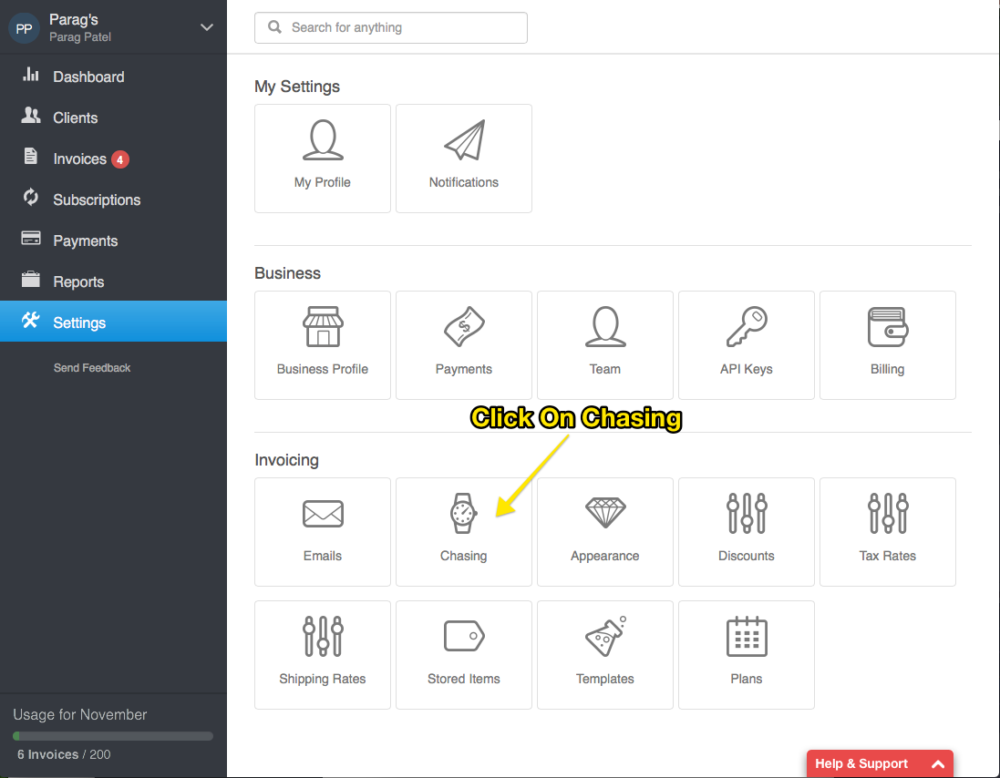

# Chasing Guide

Invoiced lets you send automatic reminders to your client for outstanding invoices according to the schedule you specify. We call this feature **chasing**.

Chasing can help you close the gap on getting paid by reminding customers to pay. In order to start chasing invoices you must set up a schedule and then turn enable chasing for the invoices you want to chase.

## Chase Schedules

You must specify the schedule that you want your invoices to be chased with. We will stop chasing an invoice once the schedule is finished or when the invoice is paid or closed.

Schedules are defined as a series of steps each specifying the number of days relative to the invoice due date when a reminder should be sent. Chase schedules can also have a repeater at the end that sends reminders every N days until the invoice is paid or closed.

Your chasing schedule can be built from the following types of steps:

1. **Before the due date** - sends a reminder N days *before* the due date
2. **After the due date** - sends a reminder N days *after* the due date
3. **Repeater** - sends a reminder *every N days after* the due date until the invoice is paid or closed.

We will then only chase invoices that have a due date and chasing enabled on the invoice. Once the schedule has been completed or the invoice is paid or closed then chasing will stop.

## Getting Started

First you will need to enable chasing for your account in the settings and set up a schedule.

Go to **Settings** > **Chasing**.

Flip the **Allow Chasing** toggle.

Now we are ready to set the chasing schedule in order to instruct Invoiced exactly when to send reminders. Click on **+ Step** to add your first and subsequent steps to the chasing schedule.

You can remove existing steps or add new ones easily. We will automatically sort the schedule for you.

When finished click **Save**. Chasing is now enabled for your account. All that's left is to enable chasing on the invoices you want chased.

### Chasing Invoices

When drafting an invoice you can turn on chasing by clicking **Options** at the top of the screen and enabling the **Chasing** setting.

If the invoice has already been created then you can simply click **Enable** under the *Invoice Details* section (next to where it says `Chase: No`). Your invoice will now be chased according to the schedule you set up. The next chase date will be shown in the *Invoice Details* section.

### Further Customization

#### Enable Chasing by Default

If you want chasing enabled by default when drafting new invoices then you enable the **Chasing** setting in **Settings** > **General** > **Defaults**.

#### Customizing the Chasing Email Templates

The email template used for chasing reminders depends on the invoice's status.

1. **New Invoice Email**
   This email template is used when the invoice has not been sent yet.

2. **Invoice Reminder Email**
   This email template is used when the invoice has already been sent but is not due yet.

3. **Late Payment Reminder Email**
   This email template is always used when the invoice is past due.

You can learn more about customizing email templates in the [Emails Guide](emails#customizing-email-templates).

## Examples

Here are a few examples how Invoiced will behave given a chasing schedule.

### Schedule with one-time reminders

Given the following schedule:

1. Send a reminder **7** days **before** the due date
2. Send a reminder **5** days **after** the due date

Let's say our invoice is due on *September 10th*. Or client will receive a reminder the week before it is due, on *September 3rd*. If it still is not paid then on *September 15th* they will receive a late payment reminder.

### Schedule with repeating reminders

Given the following schedule:

1. Send a reminder **7** days **before** the due date
1. Send a reminder **0** days **after** the due date
2. Send a reminder **5** days **repeating**

Like the previous example our invoice is due on *September 10th*. As with the previous example they will receive a reminder the week before. They will receive another reminder on the due date, *September 10th*, if the invoice is still not paid. By *September 15th* if they still have not paid then they will receive a late payment reminder, and again every 5 days until the invoice is paid or closed.
