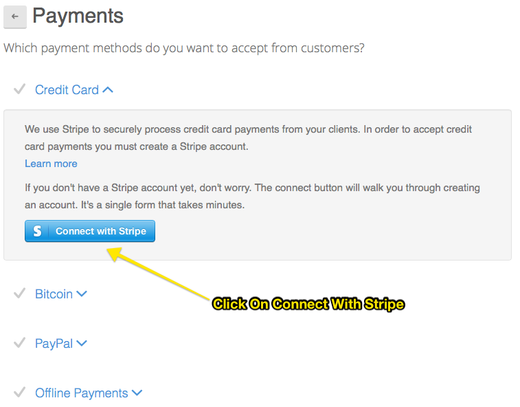
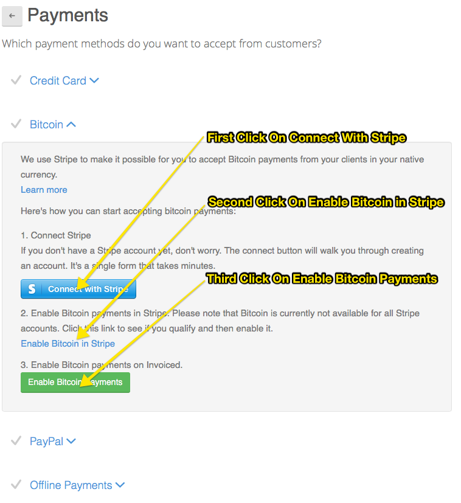

#Payments Guide

Payments are at the core of Invoiced. Invoiced handles your online payments as well as giving you tools to track offline payments.

Online payments let your customers directly pay invoices through Invoiced. If a customer pays online we will automatically record the payment. We currently support credit/debit cards, [ACH](https://en.wikipedia.org/wiki/Automated_Clearing_House), [bitcoin](https://en.wikipedia.org/wiki/Bitcoin), and PayPal.

Offline payments represent transactions that happen outside of Invoiced, like a wire transfer for example. You can track offline payments regardless of the payment instrument used. 

Unlike online payments, offline payments must be recorded in the dashboard once received.

## Online Payments

Online payments are essential if you want to get paid quicker. They also are key to auto-charging your clients with subscriptions.

You can accept credit/debit card, ACH, and bitcoin payments through [Stripe](https://stripe.com), the payment processor we have partnered with. Our set up process will help you easily sign up for a merchant account. You can also accept [PayPal](https://paypal.com) payments.

*If you need to accept payments through a different payment processor then please get in touch.*

###Setting up Online Payments

Invoiced makes setting up Stripe and PayPal dead simple. Here is how you can set them up.

Go to **Settings** > **Payments**

### Accepting Credit Card Payments

Accepting credit cards is currently the quickest way to get paid online. Unfortunately it is also one of the more expensive payment methods for merchants due to a variety of reasons. In most locations Stripe currently charges *2.9% + .30* per transaction, although this may vary by your country.

Once you are ready to start accepting credit card payments simply click on **Credit Card** > **Connect With Stripe**.

If you don't have a Stripe account yet, don't worry. The connect button will walk you through creating an account. It's a single form that takes minutes to complete. Once completed you can start accepting payments right away.

#### Client Workflow for Credit Card Payments

Paying with credit/debit card is fairly straightforward for clients. They simply enter the card information, the amount they want to pay, and click pay. We will give them a receipt following the transaction.

### Accepting ACH Payments

ACH payments allow customers to pay online using a bank account. Payments happen through the ACH network, an electronic network for financial transactions in the United States. The primary benefit of ACH payments is the low transaction fee, particularly on larger transactions. Stripe currently charges *0.8%* up to a maximum of *$5* for ACH transactions.

The tradeoff when accepting ACH is that payments do not happen instantly like credit cards. Instead they take 3-7 business days depending on a variety of factors. Also unless your customer has one of the supported banks for instant verification, they must manually verify their account using micro-deposits (which takes 1-2 business days). It's for these reasons that ACH payments are primarily used for larger transactions or business to business payments.

Setting up ACH payments is simple:

1. Click on **Connect With Stripe**
2. Accept the Stripe ACH Terms of Service
3. Click on **Enable ACH Payments**

If you don't have a Stripe account yet, don't worry. The connect button will walk you through creating an account. It's a single form that takes minutes. Once completed you can start accepting payments right away.

#### Client ACH Payment Workflow

When a customer decides to pay with ACH they must first connect a bank account and verify it. The verification process depends on where they bank. We support instant verification for a few major banks, like Wells Fargo. It works by asking your client to securely sign into their online banking account. Once they sign in they will be able to select the account they want to pay with, all without ever having to enter a bank account and routing number.

Any unsupported banks will require manual verification. The manual verification process makes 2 small deposits to your customer's bank account. We will then ask them to confirm the deposit amounts to prove ownership of the account. It generally takes 2 business days for the deposits to appear.

Once a bank account has been verified then your customer can now pay invoices from you. They just have to return to the ACH payment page and click **Pay**. The transaction will have a pending status. ACH payments generally take 3-5 business days to complete. Once the transaction succeeds we will update the invoice and send the customer a receipt. In the event of a failure we will create an event in the dashboard.

Subsequent payments will not require the customer to go through the verification process again but we will ask the customer to confirm their bank account number, for their protection.

### Accepting Bitcoin Payments

Bitcoin is a decentralized virtual currency that lets you accept payments from anyone, anywhere. Our bitcoin integration automatically converts bitcoin payments into USD, making it super easy to start accepting bitcoin.

One of the advantages of bitcoin is that payments can be made by anyone holding bitcoins, and not just those with access to a credit card. The transaction fees are also quite a bit lower. Stripe currently charges *0.5%* per successful transaction.

*We should note that although bitcoin shows a lot of promise, it is still in its infancy and has a ways to go before it reaches mass consumer adoption. It might not make sense to accept bitcoin right now unless there is demand from your customer base to pay with bitcoin.*

Setting up bitcoin payments is simple:

1. Click on **Connect With Stripe**
2. Accept the Stripe Bitcoin Terms of Service
3. Click on **Enable Bitcoin Payments**

If you don't have a Stripe account yet, don't worry. The connect button will walk you through creating an account. It's a single form that takes minutes. Once completed you can start accepting payments right away.

****

#### Client Workflow for Bitcoin Payments

If a client chooses to pay with bitcoin then the amount of BTC owed will be calculated according to the current exchange rate. The amount will be valid for approximately 10 minutes. The payment screen will show a unique wallet address to send the BTC. Once the transaction has been verified then the customer will receive a receipt.

If the wrong amount of BTC was received or it was received outside of the conversion rate window then the customer will be refunded.

### Accepting PayPal Payments

Click on **PayPal** and enter in your PayPal email address or click on learn more to register for one at PayPal and than enter in the PayPal address. Than click Save.

****

#### Client Workflow for PayPal Payments

On the payment page we will generate a **Pay with PayPal** button that takes your customer to PayPal's checkout process. There they will be able to pay using a PayPal account or as a guest.

### Withdrawing Your Money

You just received your first online payment (congrats!), now what?

Stripe transfers incoming payments to your bank account automatically on a daily basis. Once you have received your first payment with Stripe the first transfer generally takes 7 business days. After that your transfers will happen on a 2-day or 7-day rolling basis depending on your account. You can learn more [here](https://stripe.com/help/transfers).

Any PayPal payments will go to your PayPal balance, which you can withdraw or use to pay others.

## Offline Payments

Invoiced lets you give instructions to your clients about the different offline payments methods you accept. This is done in a nice workflow. 

To set this up go to **Settings** > **Payments**

****

Then enable which offline payments you accept, and provide instructions for them.

### Client Workflow for Offline Payments

When your client selects one of your offline payment methods from the payment screen they will be given your payment instructions. They can even notify you when the check is in the mail.

You can see what this looks like for your client in our [Getting Started Guide](/docs#getting-paid).

##Refunding Payments

Whenever a payment is made on a invoice generated by a subscription (automatic or manual) or invoice, Invoiced records a payment.

To get a quick glance at all the invoices, subscriptions, and payments a client has, simply go into the client details by clicking on a client name, after you selected *Clients* from the left navigation bar.

Simply click on a payment you want to refund. Once the payment details show up, click on the **Refund** button.

****

## Credits

Invoiced supports issuing credits to customers that can be used on future invoices. Once you give credit to a customer it can be used to pay invoices.

The reasons for crediting a customer are many. Maybe they referred a friend and you want to give them a bonus to spend with you later. Another common scenario is when a customer overpays. It's easier to credit the customer's account if you know they are coming back instead of issuing a refund.

### Adding credits

1. Open the customer you want to credit in the dashboard.

2. Click **Add Credit** underneath the client's balance.

3. Enter the amount to credit and any notes. Click **Save** when you are finished. The customer's balance will be updated to reflect the new credits.

### Using Credits

Once you have added credits to your customer's account then you are now able to use them. By default we will automatically apply credits to new invoices you issue for that customer. If you have the **Apply Credits to New Invoices** setting turned off or want to credit an existing invoice then you can follow these steps:

Steps to use credits:

1. Click the **Record Payment** button in the dashboard for a customer, invoice, or in the *Payments* section.

2. Select the customer that wants to use the credits (if not already selected).

3. We will load any available credits for that customer. Click the **Pay using credits** link.

4. Select an invoice to apply the credits to (if one is not already selected).

5. Click **Create** to apply the credits to that invoice. The invoice and customer balance will be updated immediately.

### Automatically apply credits to new invoices

The **Apply Credits to New Invoices** setting will automatically apply any available credits when a new invoice is raised against your customer's account. This setting is on by default, but can be changed in **Settings** > **Payments**.

## Overpayments

Whenever customers pay electronically Invoiced will always ensure the payment is for the correct amount. However, if you accept offline payments, like checks or wire transfers, it is possible that customers will overpay. We've tried to make handling overpayments as easy as possible.

If your customer pays too much there are two ways it can be handled:

1. Credit the customer's balance for use on future invoices

2. Issue a refund for the amount overpaid

When you record a payment through the dashboard and there is money left over after applying the amount to any outstanding invoices then we will give you a choice to **credit** or **refund** the overpayment amount. If you choose to refund the amount then we will record a refund on Invoiced, but actually sending those funds back to your customer will be left up to you since the original payment was not electronic.