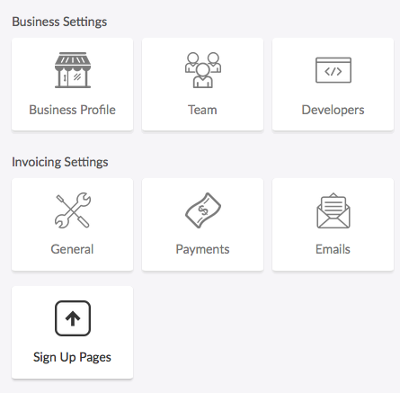
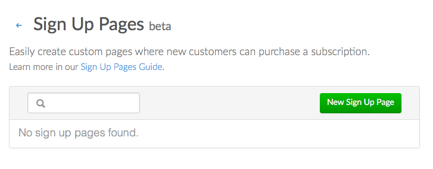
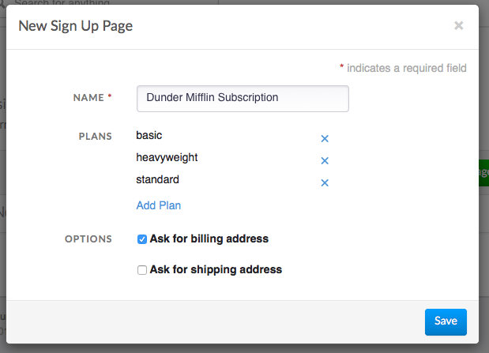

# Sign Up Pages

Easily build hosted pages for onboarding new customers into subscription billing. Building a sign up page is super quick and requires no coding.

A sign up page will create a new customer on Invoiced, securely collect payment information, and subscribe the customer to the plan they select. Here's an overview of the capabilities of sign up pages:

- Creating a new customer profile
- Subscribing the customer to a plan they select
- Securely vaulting a card payment source for the customer
- Collecting billing and/or shipping addresses

## Usage

Prerequisites:

1. You must have credit card payments enabled.
2. You must already have set up at least one recurring plan that you want to subscribe customers to in **Settings** > **Plans**.

### Building a sign up page

1. Go to **Settings** > **Sign Up Pages**.

   

2. Click **New Sign Up Page**.

   

3. Give your page a name and select all of the plans that should be available to customers signing up from this page. There are other options available, like asking for a billing or shipping address.

   

4. Click **Save**.

   

5. Now that your page is created it will be hosted at a unique URL within your billing portal. You can click the **View** button next to your new page to open the URL in a new tab.

   

### Signing up customers

Sign up pages are hosted on a public but obscured URL within your billing portal. The only way to discover the page is to visit the URL directly. All the customer needs to get started is the URL of the page.

There are many ways that you can direct customers to your sign up page. You can link to it from your website or app, send it to customers directly over email or text message, or seamlessly redirect customers as part of your existing checkout flow.