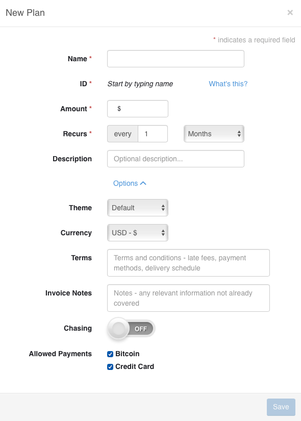

* [Getting Paid Automatically Through Subscriptions](#invoice-paid-automatically)
  * [Subscriptions](#invoice-subscriptions) 
  * [Plans](#invoice-plans)
      * [Collections Mode](#invoice-collections-mode)

###Getting Paid Automatically Through Subscriptions
Invoiced offers business a way to automatically collect money through a feature called subscriptions.

---
####Subscriptions

Subscriptions allow businesses to either automatically collect payment or automatically invoice the client on a recurring basis.

This is great if find yourself frequently invoicing your customer every month.  Using subscriptions allows you to automatically invoice & collect money from them, saving you and your client valuable time and offering convenience.

---
####**Creating a Subscription**

To create subscription, click on Subscriptions from the dashboard.  

From their click on `Add Subscription`

Now a the subscription modal will appear.

Every field with a `*`  is required to be filled out.

We first start off with adding or choosing a client in the `Client` field.

We than add or choose a plan in `Plan` field.  Plans are a important concept to understand and we will discuss them in the next section.

---
####What is a plan

Plans are sort a template for creating a subscription.  You will find that the plan actually specify how often the client is invoiced or charged, how much they are invoiced for, the currency, description, terms, notes, allowed payments and whether the payment should be chased.

The advantages of using a plan are that it can save you time from having to re-enter the information mentioned above.  

From the Subscription Modal you can create a new plan.

---
We will go over most of fields in a plan

If you click on `Options` you will get a even more customization options for the plan.

You will want to add `Name`, `Amount`, `Recurs` at a minimum.  `ID` will be auto-generated based on `Name`.

Most of the fields are self-explanatory.  

`Recurs` field is where you specify how often and how many times the subscription will run for.

**Example:**  

---
####Back To Subscriptions
The subscription modal has few fields that you want to understand. 

`Duration` has 2 options `Until Canceled` and `Fixed duration`

`Until Canceled` means the subscription will be executed until it is explicitly canceled.  

`Fixed duration` specify how long the subscription can go on for.

Choosing `Until Canceled` means it can gone on forever potentially until someone explicitly cancels it.

**Additional Items**

Additional items are line items, discounts, taxes that you add to subscription on top what the plan charges for.  It gives you the flexibility and power to customize the subscription to your client.

`Addons`, `Discounts`, `Taxes` let you add specific line items, taxes, and discounts to your subscription.

**Example**: Suppose you have business called `ACME Landscaping Services` and you suppose you setup have a monthly landscaping plan that costs $200 a month.  
Some of your clients might want additional services such has hedge trimming.  So you would add create a 'hedge trimming' add-on for those clients that want that and want to subscribe.

**Quantity**

`quantity` is an important field to understand.  The total amount your client is charged on the subscription is the `plan amount * quantity`. 

**Example**

If certain clients have 2 more homes that need landscaping, we can simply increase the quantity without having to subscribe that client to more subscriptions.  